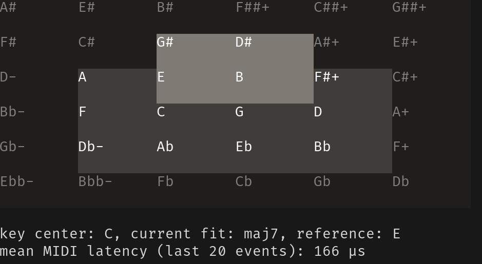

# Terminal user interface

 

You'll see panels with note names arranged in a grid of (just) fifths and
(just) major thirds. At every moment, this grid will highlight
- 12 "possible reference" notes, which are shown with a slightly lighter
  background, and
- the currently sounding notes, which are shown with an even lighter
  background.

Additionally, near the bottom of the frame you'll get information on 
- the current key center, 
- the "current fit" for the sounding notes, i.e. the type of chord the program
  thinks you're playing at the moment, and 
- the reference note of that chord.

If a mode with tempered intervals is used, the panels will show the severity of
the deviation from just intonation by their color, and with a number of cents.

## Key bindings

- 'q' quits.
- 'Esc' resets everything to the initial state.
- 'Space' changes the key center to the current reference note. This will also
  move the 12 possible reference notes, which will group around the new key
  center in the same shape as they did around the old key center. The initial
  key center is C.
- Clicking on any panel adds that note to the set of 12 possible reference
  notes (and deletes the enharmonic equivalent).
- 'p' (de)activates chord "pattern matching". Initially, this is on. If you
  deactivate it, only the (lighter gray) 12 possible reference notes are used
  for all notes played.
- numbers (de)activate temperaments. Initially, no temperaments are active.
  Currently,
  - '1' is for quarter-comma meantone fifths, and
  - '2' is for equal temperament.
- 't' (de)activates the application of temperaments to harmonic intervals.
  Initially, this is off. (Thus, normally only the reference notes are
  tempered, and chords use pure intervals relative to their reference note.)
- '-' and '+' zoom in and out.

## Note names

It is desirable for every note on the grid to have a distinct name, and only
one name. Also, we want don't want to use many additional accidentals.

In order to accomplish this, the *adaptuner* uses the note names of Ben
Johnston, which are defined as follows: 
1. The three major chords C-E-G, F-A-C, and G-B-D all are just major (4:5:6)
   triads. This defines the frequency ratios of all notes of the C major scale.
   (In particular, the interval D-A is *not* a just fifth; it is one syntonic
   comma too small.)
2. Flats and sharps denote the difference between just major and minor thirds
   (i.e. the frequency ratio 25/24).
3. Plus and minus denote the syntonic comma (i.e. the frequency ratio 81/80).
